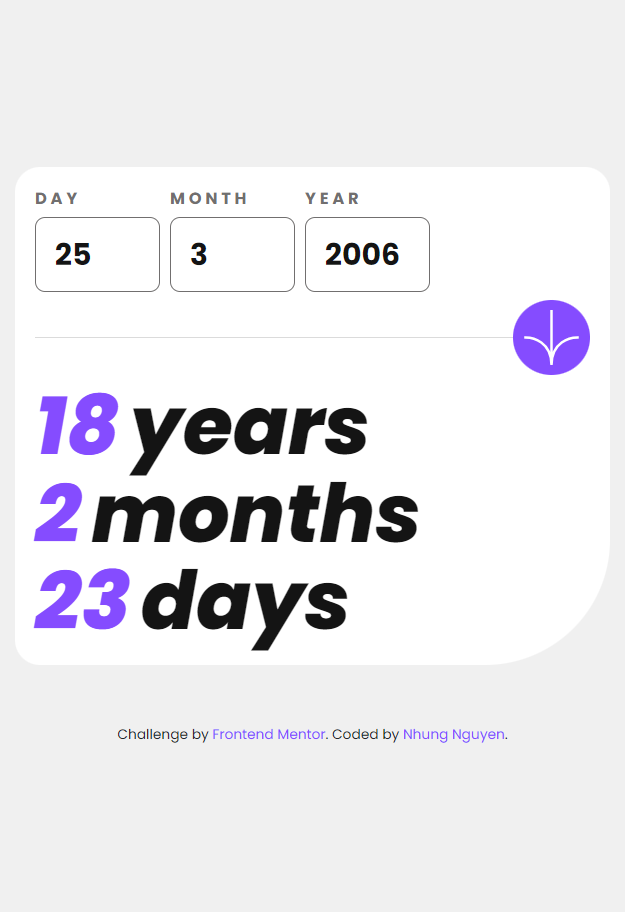

# Frontend Mentor - Age calculator app solution

This is a solution to the [Age calculator app challenge on Frontend Mentor](https://www.frontendmentor.io/challenges/age-calculator-app-dF9DFFpj-Q). Frontend Mentor challenges help you improve your coding skills by building realistic projects. 

## Table of contents

- [Overview](#overview)
  - [The challenge](#the-challenge)
  - [Screenshot](#screenshot)
  - [Links](#links)
- [My process](#my-process)
  - [Built with](#built-with)
  - [What I learned](#what-i-learned)
  - [Continued development](#continued-development)
- [Author](#author)

**Note: Delete this note and update the table of contents based on what sections you keep.**

## Overview

### The challenge

Users should be able to:

- View an age in years, months, and days after submitting a valid date through the form
- Receive validation errors if:
  - Any field is empty when the form is submitted
  - The day number is not between 1-31
  - The month number is not between 1-12
  - The year is in the future
  - The date is invalid e.g. 31/04/1991 (there are 30 days in April)
- View the optimal layout for the interface depending on their device's screen size
- See hover and focus states for all interactive elements on the page
- **Bonus**: See the age numbers animate to their final number when the form is submitted

### Screenshot





### Links

- Solution URL: [solution URL here](https://github.com/rose-de-pur-nguyen/FRONTEND-MENTOR-age-calculation-app.git)
- Live Site URL: [live site URL here](https://rose-de-pur-nguyen.github.io/FRONTEND-MENTOR-age-calculation-app/)

## My process

### Built with

- Semantic HTML5 markup
- CSS custom properties
- Flexbox
- CSS Grid
- Mobile-first workflow
- Javascript
- Bootstrap

### What I learned

- a lot of JS :) i didn't encounter much with the days calculation logic but i did with the error alerts. I wanted to write strict code to obey the valid number of days within a specific month. Especially february, whether it has 28 or 29 days depends on the input year is a leap year or not. kinda fun must say that


```js
  if (month === "2") {
    previousMonth[1] = (year % 4 === 0) ? 29 : 28;
  }

```


### Continued development

- Javascript and the logical mindset 

## Author

- Frontend Mentor - [@rose-de-pur-nguyen](https://www.frontendmentor.io/profile/rose-de-pur-nguyen)

